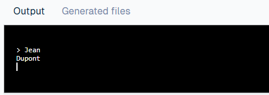
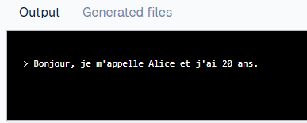
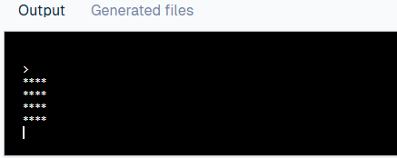
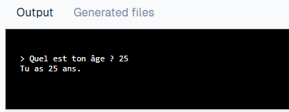
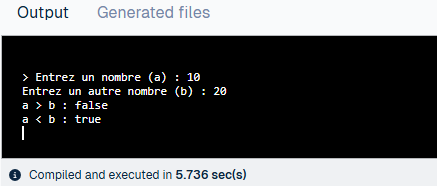

# Exercices Java - Cours 03

Ces exercices couvrent : **sorties console**, **entrées console**, et **opérateurs relationnels/logiques**.

---

## Partie 1 : Sorties Console

### Exercice 1
Écris un programme qui affiche ton prénom et ton nom sur deux lignes.  

  


```java
public class Ex1 {
    public static void main(String[] args) {
        System.out.println("Jean");
        System.out.println("Dupont");
    }
}
```

### Exercice 2
Affiche la phrase : `Bonjour, je m'appelle Alice et j'ai 20 ans.`  
  

```java
public class Ex2 {
    public static void main(String[] args) {
        System.out.println("Bonjour, je m'appelle Alice et j'ai 20 ans.");
    }
}
```

### Exercice 3
Affiche un carré formé d’étoiles `*` (4x4).  
  

```java
public class Ex3 {
    public static void main(String[] args) {
        System.out.println("");
        System.out.println("****");
        System.out.println("****");
        System.out.println("****");
        System.out.println("****");
    }
}
```

### Exercice 4
Affiche les nombres de 1 à 5, chacun sur une ligne.  
  

```java
public class Ex4 {
    public static void main(String[] args) {
        System.out.println(1);
        System.out.println(2);
        System.out.println(3);
        System.out.println(4);
        System.out.println(5);
    }
}
```

### Exercice 5
Affiche le message `Bienvenue dans le cours de Java !` avec le mot dans un affichage centré dans un tableau d'étoiles de 10 lignes.  
  

```java
public class Ex5 {
    public static void main(String[] args) {
        System.out.println("************************************************************");
        System.out.println("************************************************************");
        System.out.println("************************************************************");
        System.out.println("************************************************************");
        System.out.println("**************** Bienvenue dans le cours de Java ! ********");
        System.out.println("************************************************************");
        System.out.println("************************************************************");
        System.out.println("************************************************************");
        System.out.println("************************************************************");
        System.out.println("************************************************************");
    }
}
```

---

## Partie 2 : Entrées Console

### Exercice 6
Demande à l’utilisateur son prénom et affiche : `Bonjour <prénom> !`.  
  

```java
import java.util.Scanner;

public class Ex6 {
    public static void main(String[] args) {
        Scanner sc = new Scanner(System.in);
        System.out.print("Entrez votre prénom : ");
        String prenom = sc.nextLine();
        System.out.println("Bonjour " + prenom + " !");
    }
}
```

### Exercice 7
Demande à l’utilisateur deux nombres et affiche leur somme.  
  

```java
import java.util.Scanner;

public class Ex7 {
    public static void main(String[] args) {
        Scanner sc = new Scanner(System.in);
        System.out.print("Entrez un nombre : ");
        int a = sc.nextInt();
        System.out.print("Entrez un autre nombre : ");
        int b = sc.nextInt();
        System.out.println("La somme est : " + (a + b));
    }
}
```

### Exercice 8
Demande l’âge de l’utilisateur et affiche `Tu as X ans.`.  
  

```java
import java.util.Scanner;

public class Ex8 {
    public static void main(String[] args) {
        Scanner sc = new Scanner(System.in);
        System.out.print("Quel est ton âge ? ");
        int age = sc.nextInt();
        System.out.println("Tu as " + age + " ans.");
    }
}
```

## Opérateurs relationnels (de comparaison) et opérateurs logiques
### Exercice 9
Demande deux nombres et affiche `true` ou `false` si (a > b) et (b > a).  
  

```java
import java.util.Scanner;

public class Ex9 {
    public static void main(String[] args) {
        Scanner sc = new Scanner(System.in);
        System.out.print("Entrez un nombre : ");
        int a = sc.nextInt();
        System.out.print("Entrez un autre nombre : ");
        int b = sc.nextInt();
            System.out.println("a > b : " + (a > b));
            System.out.println("a < b : " + (a < b));
        }
}
```


---

## Partie 3 : Opérateurs Relationnels et Logiques

### Exercice 10
Demande un nombre et affiche `true` ou `false` si le nombre est positif.  
  

```java
import java.util.Scanner;

public class Ex10 {
    public static void main(String[] args) {
        Scanner sc = new Scanner(System.in);
        System.out.print("Entrez un nombre : ");
        int n = sc.nextInt();
        System.out.println("Positif: "  + (n > 0));
        System.out.println("Négatif: "  + (n < 0) );
    }
}
```

### Exercice 11
Demande un nombre et affiche `true` ou `false` si un nombre est pair ou impair.  
  

```java
import java.util.Scanner;

public class Ex11 {
    public static void main(String[] args) {
        Scanner sc = new Scanner(System.in);
        System.out.print("Entrez un nombre : ");
        int n = sc.nextInt();
        System.out.println("Pair: " + (n % 2 == 0));
        System.out.println("Impair: " + (n % 2 == 1));
    }
}
```


### Exercice 12
Demande l’âge et affiche `true` ou `false` si la personne est majeure (>=18).  
  

```java
import java.util.Scanner;

public class Ex12 {
    public static void main(String[] args) {
        Scanner sc = new Scanner(System.in);
        System.out.print("Entrez votre âge : ");
        int age = sc.nextInt();
            System.out.println("Majeur? " + (age >= 18));
            System.out.println("Mineur? " + (age <= 18));
    }
}
```

### Exercice 13
Demande un nombre et affiche `true` ou `false` s'il est compris entre 10 et 20.  
  

```java
import java.util.Scanner;

public class Ex13 {
    public static void main(String[] args) {
        Scanner sc = new Scanner(System.in);
        System.out.print("Entrez un nombre et on déterminera s'il est dans l'interval de 10 à 20: ");
        int n = sc.nextInt();
            System.out.println("Le nombre est dans l'intervalle? : " + (n >= 10 && n <= 20));
    }
}
```

# Niveau expert
### Exercice 14
Demande un caractère et vérifie s’il s’agit d’une voyelle (a, e, i, o, u).  
  

```java
import java.util.Scanner;

public class Ex14 {
    public static void main(String[] args) {
        Scanner sc = new Scanner(System.in);
        System.out.print("Entrez une lettre : ");
        char c = sc.next().charAt(0);

        // Vérification de la voyelle (en minuscule)
        boolean voyelle = c == 'a' || c == 'e' || c == 'i' || c == 'o' || c == 'u' ||
                          c == 'A' || c == 'E' || c == 'I' || c == 'O' || c == 'U';

        System.out.println("Voyelle: " + voyelle);    
        }
}
```

### Exercice 15
Demande un nombre et vérifie s’il est multiple de 3 ou de 5.  
  

```java
import java.util.Scanner;

public class Ex15 {
    public static void main(String[] args) {
        Scanner sc = new Scanner(System.in);
        System.out.print("Entrez un nombre : ");
        int n = sc.nextInt();
        System.out.println("Multiple de 3 ou 5 ? " + (n % 3 == 0 || n % 5 == 0));
    }
}
```


### Exercice 16
Vérifie si une année entrée est bissextile.  
  

```java
import java.util.Scanner;

public class Ex16 {
    public static void main(String[] args) {
        Scanner sc = new Scanner(System.in);
        System.out.print("Entrez une année : ");
        int annee = sc.nextInt();
        System.out.println("Bissextile? " + ((annee % 4 == 0 && annee % 100 != 0) || annee % 400 == 0));
    }
}
```

---
